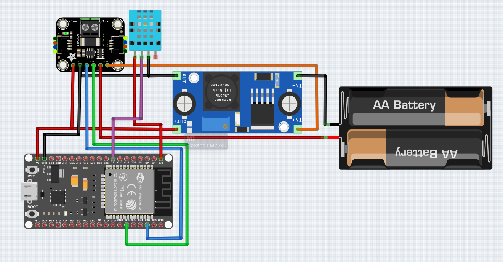

<p align="center">
Sistema de Monitoramento de Estufa de Secagem de Madeira.
</p>

<p align="justify">
Este projeto foi desenvolvido para monitorar e controlar estufas de secagem de madeira de forma automatizada, utilizando tecnologias de baixo custo e arquitetura IoT escalável. A proposta é comprovar a viabilidade de coleta, transmissão e recepção de dados de temperatura, umidade e bateria através de sensores conectados a microcontroladores ESP32, que se comunicam com uma plataforma de monitoramento através do protocolo MQTT. O sistema permite o gerenciamento de múltiplas estufas e lotes de madeira, com visualização em tempo real dos dados coletados através de uma interface web desenvolvida em React, além de armazenamento histórico de todas as medições em um banco de dados PostgreSQL. Utilizamos o broker Mosquitto para comunicação MQTT entre os dispositivos IoT e o backend Node.js, que processa e armazena os dados recebidos. A interface web oferece gráficos interativos para visualização histórica das medições e um painel administrativo para gerenciamento completo do sistema.
</p>

---

## 🧩 Tecnologias Utilizadas

- **ESP32** – Microcontrolador com suporte WiFi para comunicação IoT.
- **DHT11** – Sensor de temperatura e umidade ambiente.
- **MQTT (Mosquitto)** – Protocolo leve de mensagens usado para envio dos dados entre dispositivos e backend.
- **Node.js + Express** – Backend para processamento e armazenamento dos dados recebidos via MQTT.
- **PostgreSQL** – Banco de dados relacional para armazenamento histórico das medições.
- **React 19** – Biblioteca JavaScript para construção da interface web.
- **Chart.js** – Biblioteca de gráficos interativos para visualização dos dados.
- **Tailwind CSS** – Framework CSS utilitário para estilização responsiva.
- **Docker Compose** – Orquestração de containers para infraestrutura (PostgreSQL e Mosquitto).
- **Arduino IDE** – Ambiente de desenvolvimento para o firmware do ESP32.

---

## Arquitetura

<div align="center">
       
</div>

Os dados coletados localmente pelo ESP32 através do sensor DHT11 são enviados através do protocolo MQTT para o broker Mosquitto, que faz o repasse das informações para o backend Node.js. O backend processa as mensagens recebidas e armazena os dados no banco de dados PostgreSQL. A interface web React consome a API REST do backend para exibir os dados em tempo real e gráficos históricos das medições.

---

## Esquema de conexão

<div align="center">
    
</div>

Este diagrama mostra a ligação completa dos componentes, incluindo o ESP32, o sensor DHT11, o módulo de medição INA219, o conversor DC-DC LM2596 e a fonte de alimentação.

### 📦 Componentes Conectados:

#### 1. [DHT11](documentacao/DHT11-module.md) (Sensor de Temperatura e Umidade)

- Alimentado com **3.3V**
- Pino de dados conectado ao **GPIO33**
- GND conectado ao GND do ESP32

#### 2. [ESP32](documentacao/esp32-module.md)

- Microcontrolador principal responsável pela coleta de dados
- Conectividade WiFi para comunicação com o broker MQTT
- Alimentação VIN do esp conectado ao Vin+ do [INA219](documentacao/INA219-module.md)

#### 3. [INA219](documentacao/INA219-module.md) (Sensor de Corrente e Tensão)
- Utilizado para monitorar o consumo de energia.
- Comunica-se com o ESP32 via interface **I2C**.
- Mede corrente e tensão para calcular a potência.

#### 4. [LM2596](documentacao/LM2596-module.md) (Conversor DC-DC)
- Reduz a tensão de entrada para alimentar os componentes.
- Converte a tensão de uma fonte externa (e.g., 8,2V) para **5V**.
- Garante uma alimentação estável para o ESP32 e sensores.

---

## Dashboard

<div align="center">

</div>

Interface web desenvolvida em React que exibe os dados coletados em tempo real. O dashboard permite visualizar temperatura, umidade e bateria de cada estufa, além de gráficos históricos das medições.

### 🛠️ Funcionalidades do Dashboard

> ⚠️ **Pré-requisito:** Certifique-se de que o backend está rodando e que há dados sendo coletados pelos sensores e armazenados no banco de dados.

#### Visualização de Dados:

1. **Página Principal**: Exibe todas as estufas cadastradas em formato de tabela
2. **Seleção de Estufa**: Dropdown no topo permite selecionar uma estufa específica para visualização detalhada
3. **Cards de Informação**: Mostram os valores atuais de temperatura, umidade e bateria
4. **Gráficos Interativos**: Três gráficos de linha mostrando a evolução histórica de:
   - Temperatura (°C)
   - Umidade (%)
   - Bateria (%)

#### Painel Administrativo:

1. Acesse através do botão **Login** no canto superior direito
2. Após autenticação, você terá acesso a:
   - **Cadastrar Nova Estufa**: Adicione novas estufas ao sistema
   - **Cadastrar Sensor**: Associe sensores às estufas
   - **Ver Sensores**: Liste todos os sensores cadastrados
   - **Cadastrar Admin**: Crie novas contas de administrador

---

## Documentação

- 📘 [ESP32](documentacao/esp32-module.md)
- 🔌 [DHT11](documentacao/DHT11-module.md)
- ⚡ [INA219](documentacao/INA219-module.md)
- 🔋 [LM2596](documentacao/LM2596-module.md)
- 📚 [Firmware](firmware/firmware.ino)
- 🗄️ [Schema do Banco de Dados](db/migrations/migrations.sql)
- 🌐 [Frontend](frontend/README.md)

---

## 🚀 Como executar o projeto

### 1️⃣ Pré-requisitos

Antes de começar, certifique-se de ter instalado:

- **Node.js** (versão 18 ou superior)
- **npm** ou **yarn**
- **Docker** e **Docker Compose**
- **Git**
- **Arduino IDE** (para upload do firmware)

### 2️⃣ Clonar o repositório

```bash
git clone https://github.com/seu-usuario/estufa-secagem-de-madeira.git
cd estufa-secagem-de-madeira
```

### 3️⃣ Configurar o Docker Compose

Inicie os serviços de infraestrutura (PostgreSQL e Mosquitto):

```bash
docker-compose up -d
```

### 4️⃣ Configurar o Backend

```bash
cd backend
npm install
```

Edite o arquivo `server.js` e `src/mqtt/mqtt_client.js` com as credenciais do seu banco de dados:

```javascript
const pool = new Pool({
  user: "myuser",
  host: "localhost",
  database: "mydatabase",
  password: "mypassword",
  port: 5432,
});
```

Inicie o servidor backend:

```bash
npm start
```

O servidor estará rodando em `http://localhost:5000`.

### 5️⃣ Configurar o Frontend

Em um novo terminal:

```bash
cd frontend
npm install
npm run dev
```

O frontend estará disponível em `http://localhost:5173`.

### 6️⃣ Configurar o Firmware

1. Abra o arquivo `firmware/firmware.ino` no Arduino IDE
2. Instale as bibliotecas necessárias:
   - WiFi (incluída no ESP32)
   - PubSubClient
   - DHT sensor library
3. Configure as credenciais WiFi e MQTT:

```cpp
const char* ssid = "SUA_REDE_WIFI";
const char* password = "SENHA_DA_REDE";
const char* mqtt_server = "IP_DO_SERVIDOR_MQTT";
const char* ID_DO_LOTE = "LOTE_001";
const char* ID_DO_SENSOR = "SENSOR_001";
```

4. Faça o upload do código para o ESP32

---

## ⚙️ Configuração

### Banco de Dados

O banco de dados é inicializado automaticamente pelo Docker Compose usando o script de migração em `db/migrations/migrations.sql`.

As tabelas criadas são:

- `empresa.estufas` - Cadastro de estufas
- `empresa.sensores` - Cadastro de sensores
- `empresa.lotes` - Lotes de madeira
- `empresa.leituras` - Histórico de medições

### MQTT

O broker Mosquitto está configurado no arquivo `mosquitto/config/mosquitto.conf`. O padrão de tópicos utilizado é:

```
Estufa/{lote_id}/sensor/{sensor_id}
```

Exemplo: `Estufa/LOTE_001/sensor/SENSOR_001`

### Formato de Mensagem MQTT

O firmware publica mensagens no formato JSON:

```json
{
  "lote_id": "LOTE_001",
  "temp_c": 25.5,
  "umidade_pct": 60.0,
  "bateria_pct": 85.0,
  "status": "OK"
}
```

---

## 📁 Estrutura do Projeto

```
estufa-secagem-de-madeira/
│
├── backend/                 # Servidor Node.js
│   ├── src/
│   │   ├── api/            # Rotas da API REST
│   │   ├── loginApi/       # Autenticação
│   │   ├── registerApi/    # Registro de usuários
│   │   ├── sensoresApi/    # Gerenciamento de sensores
│   │   └── mqtt/           # Cliente MQTT
│   ├── server.js           # Servidor principal
│   └── package.json
│
├── frontend/               # Aplicação React
│   ├── src/
│   │   ├── components/     # Componentes reutilizáveis
│   │   ├── pages/          # Páginas da aplicação
│   │   ├── data/           # Funções de fetch de dados
│   │   ├── App.jsx         # Componente principal
│   │   └── main.jsx        # Entry point
│   └── package.json
│
├── firmware/               # Código Arduino/ESP32
│   └── firmware.ino        # Código do microcontrolador
│
├── db/                     # Scripts de banco de dados
│   └── migrations/
│       └── migrations.sql  # Schema do banco
│
├── mosquitto/              # Configuração do broker MQTT
│   ├── config/
│   │   └── mosquitto.conf
│   └── data/
│
└── docker-compose.yml      # Orquestração de containers
```

---

## 🔌 API Endpoints

### Autenticação

- `POST /login` - Autenticação de usuário
- `POST /register` - Registro de novo administrador

### API Principal

- `GET /api/lotes` - Lista todos os lotes
- `POST /api/lotes` - Cria um novo lote
- `GET /api/leituras` - Obtém últimas 100 leituras

### Sensores

- `GET /api/sensores` - Lista todos os sensores
- `POST /api/sensores` - Cadastra um novo sensor

---

## Limitações

<p align="justify">
Durante a implementação do projeto encontramos algumas dificuldades que merecem menção:


- **Configuração manual de credenciais**  
  As credenciais de WiFi e MQTT precisam ser configuradas manualmente no código do firmware antes do upload.  
  _Solução futura:_ Implementar um portal de configuração via WiFi (WiFiManager) para facilitar a configuração sem necessidade de recompilar o código.

</p>

---

## 🔒 Segurança

- Senhas são criptografadas usando bcrypt
- Rotas administrativas protegidas com autenticação
- Validação de dados no frontend e backend
- CORS configurado para segurança
