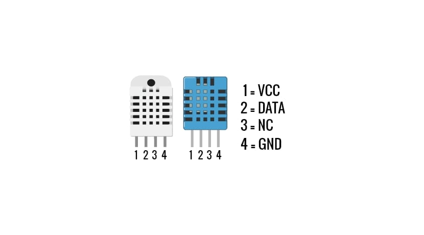

# DHT11

O **DHT11** é um sensor digital de baixo custo e fácil utilização, projetado para medir a temperatura e a umidade relativa do ambiente. Uma opção popular para projetos escolares e amadores que necessitam coletar dados climáticos básicos.

# **Características e Funcionalidade:**

- **Medições:** Fornece leituras de temperatura (tipicamente de 0°C a 50°C) e umidade relativa (de 20% a 90% RH).
    
- **Interface:** Utiliza um barramento de um fio para comunicação, o que significa que precisa de apenas um pino de dados para se conectar a um microcontrolador como o **ESP32**.
    
- **Precisão:** Embora seja acessível, sua precisão é moderada (±2°C para temperatura e ±5% RH para umidade), sendo adequado para aplicações não críticas.
