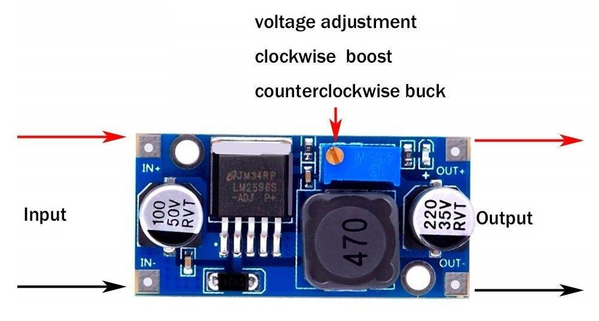

# LM2596

O LM2596 é um módulo conversor DC-DC Step-Down, utilizado para reduzir uma tensão de entrada mais alta para uma tensão de saída mais baixa e estável. É essencial para alimentar circuitos eletrônicos que necessitam de uma tensão específica e mais baixa do que a fonte de alimentação disponível.

# Características e Funcionalidade:

- Função Principal: Converte uma tensão de entrada DC em uma tensão de saída DC menor, de forma eficiente.

- Eficiência: Por ser um conversor chaveado, é muito mais eficiente do que reguladores lineares, dissipando menos calor e desperdiçando menos energia.

- Regulação: A tensão de saída pode ser ajustada, geralmente por um potenciômetro no próprio módulo, permitindo configurar a tensão exata para o seu projeto (por exemplo, de 12V para 5V, ou de 5V para 3.3V).

- Corrente: Suporta correntes de saída razoáveis, tornando-o adequado para alimentar microcontroladores (como o ESP32) e outros módulos (como o INA219 ou DHT11) a partir de uma fonte de energia mais robusta (como uma bateria de 12V ou um adaptador de parede).
