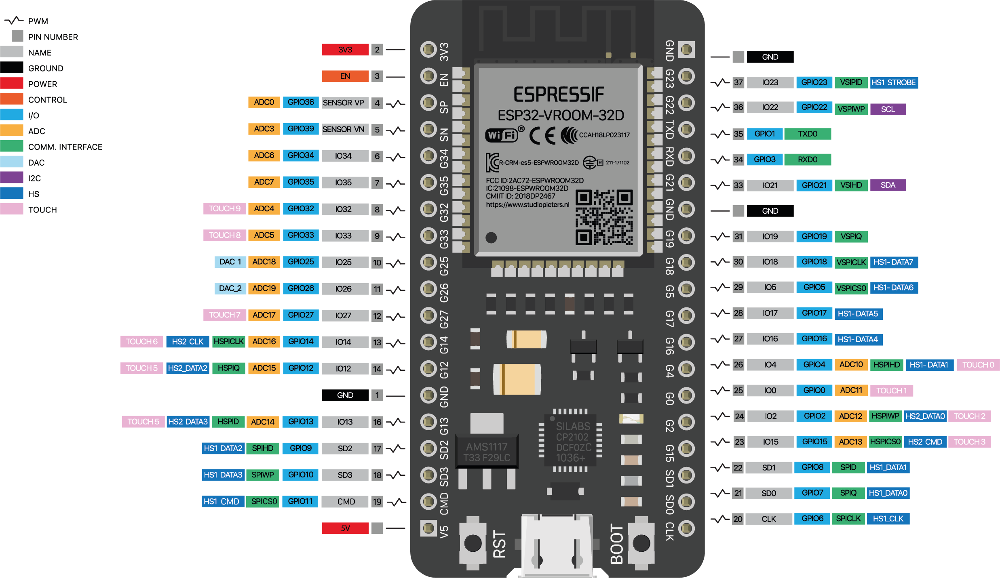

# Esp-WROOM-32

O ESP32 é um microcontrolador de baixo custo e alta integração, desenvolvido pela Espressif Systems. Ele é a escolha ideal para projetos escolares de Internet das Coisas (IoT) devido aos seus recursos integrados de comunicação Wi-Fi e Bluetooth, que permitem a fácil conexão com a internet e outros dispositivos.

## Características Principais:

- Processador: CPU dual-core de 32 bits, oferecendo alto desempenho para tarefas complexas.

- Conectividade: Possui módulos Wi-Fi (802.11 b/g/n) e Bluetooth (Classic e LE - Low Energy) integrados.

- Periféricos: Oferece uma variedade de interfaces (GPIOs, I2C, SPI, UART, ADC, DAC) essenciais para interagir com sensores e módulos externos, como o INA219 (monitor de corrente/tensão) e o LM2596 (conversor de energia step-down).
